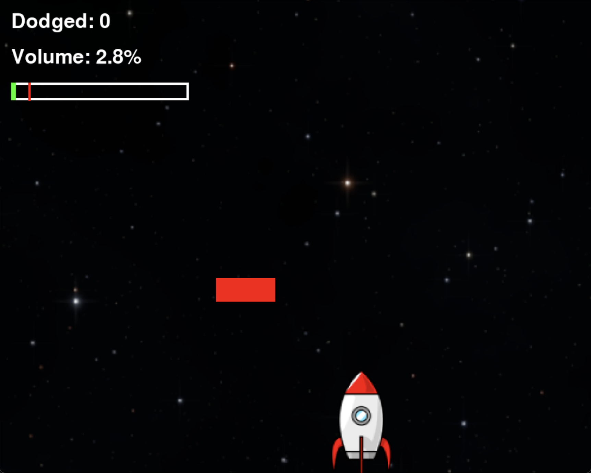

# Commandr AI

[LIVE DEMO](https://youtu.be/s3oYkjI3bO0?si=fwtmQQqIQTqFNHtM)

This project demonstrates hands-free voice-controlled gaming using the [Omi wearable AI device](https://www.omi.me/). Players control a spaceship by **shouting** to switch lanes and dodge obstacles - no keyboard or controller needed!



## How It Works

- **Voice Detection**: Omi device captures audio at 8kHz, 16-bit PCM
- **Amplitude Triggering**: Loud sounds (shouts) trigger lane switches
- **Progressive Difficulty**: Game gets faster as you dodge more obstacles
- **Real-time Processing**: Audio streams via Bluetooth Low Energy (BLE)

## Features

- 🎙️ **Fully Voice-Controlled** - Shout to switch lanes
- 🚀 **Progressive Difficulty** - Speed increases with score
- 🎨 **Particle Effects** - Visual feedback for lane switching
- 🏆 **Combo System** - Chain dodges for bonus points
- 📊 **Real-time Audio Monitoring** - Debug tool included
- 🎯 **Multiple Obstacle Types** - Normal, fast, and big obstacles

## Requirements

- **Python 3.12+**
- **macOS** (tested on Apple Silicon, should work on Intel)
- **Omi Device** with Bluetooth enabled
- **Homebrew** (for Opus library)

## Setup

### 1. Install System Dependencies

Install the Opus audio library:
```bash
brew install opus
```

### 2. Set Environment Variables

Add these to your `~/.zshrc` (or `~/.bash_profile` for bash):
```bash
echo 'export OPUS_LIBRARY=/opt/homebrew/lib/libopus.dylib' >> ~/.zshrc
echo 'export DYLD_LIBRARY_PATH=/opt/homebrew/lib:$DYLD_LIBRARY_PATH' >> ~/.zshrc
source ~/.zshrc
```

### 3. Create Virtual Environment

```bash
python3 -m venv venv
source venv/bin/activate
```

### 4. Install Python Dependencies

```bash
pip install -r requirements.txt
```

### 5. Configure Omi Device

**Important**: Update the `DEVICE_ID` in both `main.py` and `test_omi.py` with your Omi device's Bluetooth UUID. Find it by running:
```bash
python3 -c "from omi import listen_to_omi; import asyncio; asyncio.run(listen_to_omi.scan())"
```

## Usage

### Test Omi Connection

First, verify your Omi device is working and calibrate the volume threshold:
```bash
python3 test_omi.py
```

Speak into your Omi device and observe the amplitude levels. Adjust `AMPLITUDE_THRESHOLD` in `main.py` if needed (default: 10%).

### Play the Game

```bash
python3 main.py
```

**Controls**:
- 🎙️ **Shout** to switch lanes
- ⌨️ **Space** (backup keyboard control)
- ⌘Q **Quit**

## Project Structure
```
.
├── main.py              # Main game
├── test_omi.py          # Omi connection test & volume calibration
├── requirements.txt     # Python dependencies
├── images/
│   ├── starfield.png   # Background
│   └── rocket.png      # Player sprite
└── README.md
```

## Audio Format Discovery

The Omi device sends **raw PCM audio** (not Opus-compressed as initially expected):
- **Format**: 16-bit PCM, Little-endian
- **Sample Rate**: 8kHz (NOT 16kHz)
- **Channels**: Mono
- **Packet Structure**: 1-byte header (sequence number) + 162 bytes audio data

This was discovered through systematic testing of different codecs, sample rates, and header configurations.

## Troubleshooting

### "Could not find Opus library"
Run:
```bash
export OPUS_LIBRARY=/opt/homebrew/lib/libopus.dylib
export DYLD_LIBRARY_PATH=/opt/homebrew/lib:$DYLD_LIBRARY_PATH
```

Or make it permanent by adding to `~/.zshrc` (see Setup step 2).

### Game too sensitive / not sensitive enough
Adjust `AMPLITUDE_THRESHOLD` in `main.py`:
- **Too sensitive** (switches on normal speech): Increase to 15-20%
- **Not sensitive** (doesn't respond to shouts): Decrease to 5-8%

### Omi device not connecting
- Ensure Omi is powered on and nearby
- Check Bluetooth is enabled on your Mac
- Verify the `DEVICE_ID` matches your device (see Setup step 5)

## Credits

- **Omi Device**: [omi.me](https://www.omi.me/)
- **Game Engine**: PyGame
- **Audio Processing**: Custom PCM decoding

## License

MIT License - See LICENSE file for details